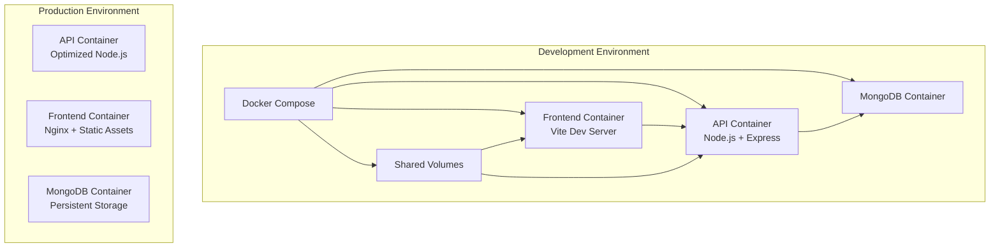

# Design Document

## Overview

This design implements comprehensive Docker support for the Basketball CRUD API & Dashboard project, providing both development and production-ready containerization. The solution uses Docker Compose for orchestration and multi-stage builds for optimization.

## Architecture

### Container Architecture


### Network Architecture
- **Development**: Single Docker network with service discovery
- **Production**: Configurable networking with health checks
- **Database**: Internal network access only, no external exposure

## Components and Interfaces

### Docker Compose Services

#### API Service (Development)
- **Base Image**: `node:18-alpine`
- **Working Directory**: `/app`
- **Port Mapping**: `3000:3000`
- **Volume Mounts**: Source code, node_modules cache
- **Environment**: Development-specific variables
- **Command**: `npm run dev` (nodemon for hot reload)

#### Frontend Service (Development)
- **Base Image**: `node:18-alpine`
- **Working Directory**: `/app`
- **Port Mapping**: `3001:3001`
- **Volume Mounts**: Source code, node_modules cache
- **Environment**: Development-specific variables
- **Command**: `npx vite --host 0.0.0.0 --port 3001`

#### MongoDB Service
- **Base Image**: `mongo:7`
- **Port Mapping**: `27017:27017` (development only)
- **Volume Mounts**: Persistent data storage
- **Environment**: Database name, authentication (if needed)
- **Health Check**: MongoDB connection verification

### Production Dockerfiles

#### API Production Dockerfile
```dockerfile
# Multi-stage build for API
FROM node:18-alpine AS builder
WORKDIR /app
COPY package*.json ./
RUN npm ci --only=production

FROM node:18-alpine AS runtime
WORKDIR /app
COPY --from=builder /app/node_modules ./node_modules
COPY . .
EXPOSE 3000
HEALTHCHECK --interval=30s --timeout=3s --start-period=5s --retries=3 \
  CMD curl -f http://localhost:3000/health || exit 1
CMD ["node", "server.js"]
```

#### Frontend Production Dockerfile
```dockerfile
# Multi-stage build for Frontend
FROM node:18-alpine AS builder
WORKDIR /app
COPY package*.json ./
RUN npm ci
COPY . .
RUN npm run build

FROM nginx:alpine AS runtime
COPY --from=builder /app/dist /usr/share/nginx/html
COPY nginx.conf /etc/nginx/nginx.conf
EXPOSE 80
HEALTHCHECK --interval=30s --timeout=3s --start-period=5s --retries=3 \
  CMD curl -f http://localhost:80 || exit 1
CMD ["nginx", "-g", "daemon off;"]
```

## Data Models

### Environment Configuration
```typescript
interface DockerEnvironment {
  NODE_ENV: 'development' | 'production'
  MONGODB_URI: string
  API_PORT: number
  FRONTEND_PORT: number
  DATABASE_NAME: string
}

interface VolumeConfiguration {
  source: string
  target: string
  type: 'bind' | 'volume'
  readOnly?: boolean
}

interface ServiceConfiguration {
  image: string
  ports: string[]
  volumes: VolumeConfiguration[]
  environment: Record<string, string>
  dependsOn: string[]
  healthCheck?: HealthCheckConfig
}
```

## Correctness Properties

*A property is a characteristic or behavior that should hold true across all valid executions of a system-essentially, a formal statement about what the system should do. Properties serve as the bridge between human-readable specifications and machine-verifiable correctness guarantees.*

<function_calls>
<invoke name="prework">
<parameter name="featureName">docker-support

Property 1: Service accessibility
*For any* running Docker Compose stack, all configured services should be accessible on their designated ports
**Validates: Requirements 1.2, 1.3**

Property 2: Database connectivity
*For any* API container startup, the service should successfully connect to the MongoDB container
**Validates: Requirements 1.4, 2.4**

Property 3: Data persistence
*For any* container restart cycle, database data should remain intact and accessible
**Validates: Requirements 2.3**

Property 4: Hot reload functionality
*For any* source code modification during development, the affected service should automatically restart
**Validates: Requirements 1.5**

Property 5: Database initialization
*For any* fresh Docker Compose startup, the MongoDB container should initialize with the correct database name and seeded data
**Validates: Requirements 2.1, 2.2**

Property 6: Production optimization
*For any* production Docker build, the resulting images should use multi-stage builds and contain only runtime dependencies
**Validates: Requirements 3.1, 3.3**

Property 7: Health check validation
*For any* production container startup, health checks should accurately report service readiness
**Validates: Requirements 3.4**

Property 8: Environment configuration
*For any* deployment environment, environment variables should override default configuration values
**Validates: Requirements 3.5, 5.1**

Property 9: Volume mounting
*For any* development setup, source code changes should be immediately reflected in running containers
**Validates: Requirements 4.1**

Property 10: Container cleanup
*For any* Docker Compose shutdown, all temporary containers and networks should be properly removed
**Validates: Requirements 4.5**

## Error Handling

### Container Startup Failures
- **Database Connection Errors**: Implement retry logic with exponential backoff
- **Port Conflicts**: Provide clear error messages and alternative port suggestions
- **Volume Mount Issues**: Validate file permissions and path existence
- **Network Failures**: Ensure proper network creation and service discovery

### Development Workflow Errors
- **Hot Reload Failures**: Graceful fallback to manual restart with user notification
- **Dependency Installation**: Clear error reporting for package installation issues
- **Log Access**: Ensure logs are always accessible even during container failures

### Production Deployment Errors
- **Health Check Failures**: Implement proper timeout and retry mechanisms
- **Resource Constraints**: Provide resource usage monitoring and alerts
- **Configuration Errors**: Validate environment variables before container startup

## Testing Strategy

### Integration Testing
- **Container Orchestration**: Verify all services start correctly with `docker-compose up`
- **Service Communication**: Test API-to-database and frontend-to-API connectivity
- **Data Persistence**: Validate data survives container restarts
- **Environment Isolation**: Ensure development and production configurations work independently

### Property-Based Testing
- **Port Accessibility**: Generate random port configurations and verify services are reachable
- **Environment Variables**: Test various environment combinations for configuration override behavior
- **Volume Mounting**: Verify file changes propagate correctly across different file types and sizes
- **Health Checks**: Test health check reliability under various service states

### Performance Testing
- **Container Startup Time**: Measure and optimize container initialization performance
- **Image Size Optimization**: Verify production images meet size requirements
- **Resource Usage**: Monitor CPU and memory consumption during normal operations
- **Hot Reload Speed**: Measure time from code change to service restart

### Security Testing
- **Secret Management**: Verify no sensitive data is exposed in images or logs
- **Network Isolation**: Test that internal services are not accessible externally
- **File Permissions**: Validate proper file system permissions in containers